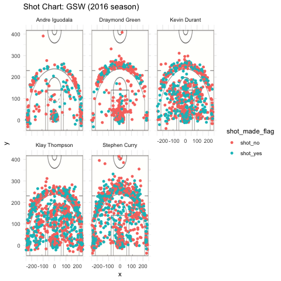

# Report

```{r ut.width="80%", echo = FALSE, fig.align = "center"}
# display shots chart of all players

```

```{r eval = FALSE}
# load package
library(dplyr)

# read players' shots data
shots_report_data <- read.csv("../data/shots-data.csv")

players_names <- c("Andre Iguodala", "Draymond Green", "Kevin Durant", "Klay Thompson", "Stephen Curry")

iguodala_report <- filter(shots_report_data, name == "Andre Iguodala")
iguodala_2pt_total <- length(iguodala_report$shot_type[iguodala_report$shot_type == "2PT Field Goal"])
iguodala_2pt_made <- count(iguodala_report$shot_type == "2PT Field Goal" & iguodala_report$shot_made_flag == "shot_yes")
```

```{r eval = FALSE}
shots_2pt <- shots_report_data
shots_2pt$total <- length(shots_2pt$shot_made_flag[shots_2pt$shot_type == "2PT Field Goal"])
shots_2pt$made <- length(shots_2pt$shot_made_flag[shots_2pt$shot_made_flag == "shot_yes" & shots_2pt$shot_type == "2PT Field Goal"])
shots_2pt$percmade <- shots_2pt$made / shots_2pt$total

iguodala_2pt <- filter(shots_2pt, name == "Andre Iguodala")
green_2pt <- filter(shots_2pt, name == "Draymond Green")
durant_2pt <- filter(shots_2pt, name == "Kevin Durant")
thompson_2pt <- filter(shots_2pt, name == "Klay Thompson")
curry_2pt <- filter(shots_2pt, name == "Stephen Curry")
curry_2pt


shots_report_data$total <- length(shots_report_data$shot_made_flag)
shots_report_data$made <- length(shots_report_data$shot_made_flag[shots_report_data$shot_made_flag == "shot_yes"])
shots_report_data$perc_made <- shots_report_data$made / shots_report_data$total
iguodala_total <- filter(shots_report_data, name == "Andre Iguodala")
green_total <- filter(shots_report_data, name == "Draymond Green")
durant_total <- filter(shots_report_data, name == "Kevin Durant")
thompson_total <- filter(shots_report_data, name == "Klay Thompson")
curry_total <- filter(shots_report_data, name == "Stephen Curry")
```

